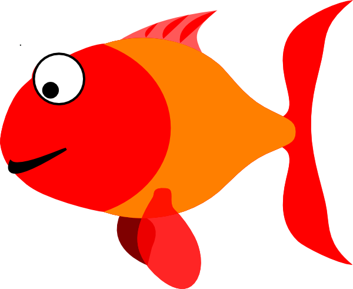

# drop in the ocean

Write a program that does [this](http://artech.cc/_class_material_/exercises/acg2014s/week4/dropInTheOcean/).

### step-by-step:
1. Write a setup() function that creates a canvas of size 500×500. Set all shapes as having no stroke and set fill to a dark blue
2. Create a draw() function with white background.
3. Create an ellipse that falls from the top of the sketch (top of Y-axis) and middle of the X-axis. You may want to consult the simplePhysics example from earlier weeks about animating an ellipse. You may want to make the droplet more interesting by adding a triangle above it, as I have done.
4. Create a global variable locX and locY, of type float, both set to 0.
5. Inside setup() have locX take a random value between 0 and the width of the window (so that every time we start the sketch the drop starts at a different place)
6. Inside draw() create a rectangle that is at the bottom of your canvas, is of the same width as your canvas and height equal to a global variable called rectHeight, initially set to 2
7. Write an if statement inside the draw() function that checks to see if the ball has passed the top part of the “sea” (the rectangle). What is the Y-coordinate of the top part of the rectangle? If it has indeed passed the line then have the rectHeight increase by 4 and have a new droplet generated (ie. locY = 0 and locX set to random)
8. Add a for loop that creates pebbles (ellipses) at the bottom
9. When the water reaches the top, have it reset to the bottom
10. Now that you are done with the above, move your code into the functions void drawDroplet(), void drawOcean().
11. <strong>Bonus 1</strong>: make the sketch interactive. Every time the user presses the mouse button have a new droplet generated
12. <strong>Bonus 2</strong>: have the droplet alternate randomly between 3 colour choices red, green and blue. Every time the droplet falls into the water it should change the sea water to its color.
13. <strong>Unltra-Bonus</strong> (for those who want a challenge): use the fish.png image below and have it pass from left to right every 5 seconds after the water level is high enough. Some hints:
<ul>
	<li>[How](http://processing.org/reference/image_.html) to load images<li>
	<li>[How](http://processing.org/reference/millis_.html) to use the millis() to measure time. Divide by 1000 to find seconds.<li>
	<li>You'll need to use the [modulo](http://processing.org/reference/modulo.html) to perform an action every x seconds.<li>	
	<li>Put it all inside a "drawFish()" function.</li>
<ul>

