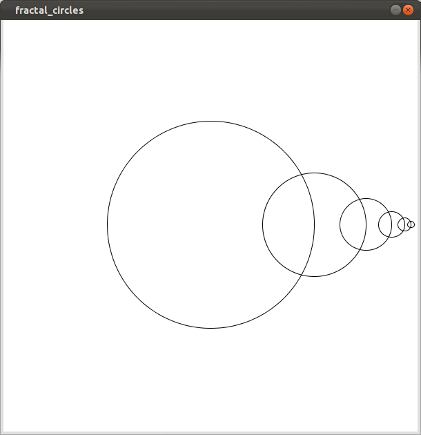

# fractal circles

### step by step

1. Copy the code provided here to get you going. Notice that I have provided the outline of the program in pseudocode. Translate steps 1-6 from pseudocode into Processing. It's <strong>very</strong> important that you do this step-by-step.
2. In step 3 we call again the drawCircle() and we give it the new position of the circle and the new diameter (which is half the original). When you complete step 3 you must see what the image below:

3. Continues with steps 4-6. When complete it must show something like what is inside final_fractal.png found in this directory.
4. BONUS: Put some color in the fractal. You must use an if-statement to make your color choices depending on the position or radius of the circle, or even pass the variable radius directly into fill().
